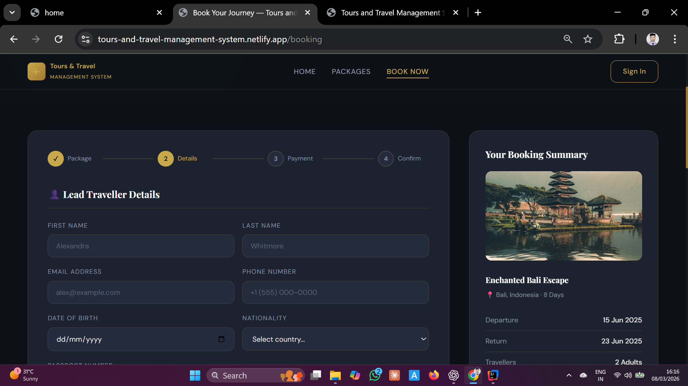
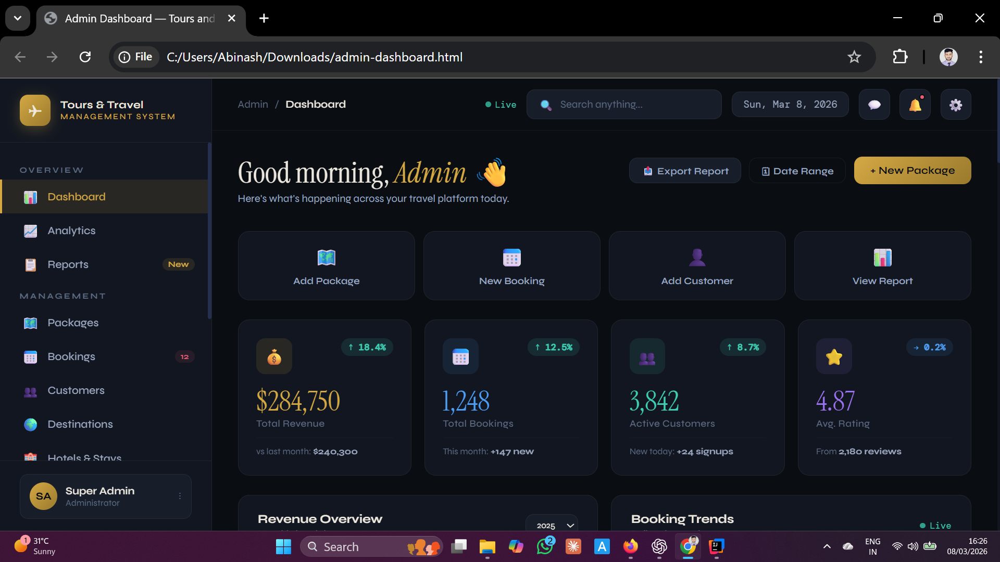

# Tours and Travel Management System


---

## About

The **Tours and Travel Management System** is a full-stack travel booking web application built using **Spring Boot, Spring Security, Razorpay, JPA/Hibernate, and Thymeleaf**.

The application allows users to explore travel packages, make bookings, and complete secure online payments. Administrators can manage packages, users, bookings, and payment records through an admin dashboard.

This project demonstrates a **complete backend-driven web application using Spring Boot MVC with Server-Side Rendering (SSR)**.

### Frontend UI Preview

A **static preview of the UI (HTML templates)** is deployed for demonstration purposes:

[https://tours-and-travel-management-system.netlify.app](https://tours-and-travel-management-system.netlify.app)

 

---
 

## Documentation

Full technical documentation for this project is available here:

### Live Documentation
https://tours-travelproject-documentation.netlify.app/

### Repository Version
[View HTML Documentation](docs/project-documentation.html)

---

---
## Documentation

Full technical documentation for this project is available here:

Live Documentation :-
https://tours-travel-docs.netlify.app

Repository Version
   :- docs/project-documentation.html

---

## Tech Stack

| Layer                 | Technologies                                                        |
| --------------------- | ------------------------------------------------------------------- |
| **Backend**           | Java 21, Spring Boot 3, Spring Security, Spring Data JPA, Hibernate |
| **Frontend**          | Thymeleaf, HTML5, CSS3, JavaScript                                  |
| **Database**          | H2 (development), MySQL (production)                                |
| **Payment Gateway**   | Razorpay                                                            |
| **Build Tool**        | Maven                                                               |
| **Development Tools** | Lombok, Spring Boot DevTools                                        |
| **IDE**               | IntelliJ IDEA / Eclipse                                             |

---

## Features

### User Features

- Secure user registration and login
- Browse available travel packages
- View package details
- Book travel packages
- Secure payment via Razorpay
- Track booking status

### Admin Features

- Manage travel packages
- Manage registered users
- Monitor bookings
- Monitor payments
- Role-based access control

---

## System Architecture

The application follows a **layered Spring Boot architecture** with **Model-View-Controller (MVC)** design.

Server-side rendering is implemented using **Thymeleaf templates**, which allows the backend to generate dynamic HTML pages.

**Architecture flow:**

```
Browser
   │
   ▼
Spring MVC Controller
   │
   ▼
Service Layer (Business Logic)
   │
   ▼
Repository Layer (Spring Data JPA)
   │
   ▼
Database (H2 / MySQL)
```

### Key Design Principles

- Clear separation of concerns between layers
- Secure authentication with Spring Security
- Payment integration using Razorpay
- Server-side rendering using Thymeleaf
- Clean layered architecture

---

## Payment Flow

```
User selects travel package
        ↓
Application creates Razorpay order
        ↓
User completes payment
        ↓
Backend verifies payment
        ↓
Booking confirmed and stored in database
```

---

## Database Design

### Main Entities

**User**
- id
- name
- email
- password
- role

**TravelPackage**
- id
- destination
- description
- price

**Booking**
- id
- user_id
- package_id
- booking_date
- status

**Payment**
- id
- booking_id
- payment_id
- payment_status

### Relationships

```
User (1) ---- (N) Booking
Booking (N) ---- (1) TravelPackage
Booking (1) ---- (1) Payment
```

---

## Project Structure

```
src/main
├── java/com/aj
│   ├── controller
│   ├── service
│   ├── repository
│   ├── entity
│   ├── dto
│   ├── security
│   └── exception
└── resources
    ├── static
    │   ├── css
    │   ├── js
    │   └── images
    ├── templates
    │   ├── admin
    │   └── user
    └── application.properties
```

---

## Getting Started

### Prerequisites

- Java 21+
- Maven
- MySQL (optional — H2 is used by default)
- IntelliJ IDEA or Eclipse

---

### Clone the Repository

```bash
git clone https://github.com/Aj-world/TOURS-AND-TRAVEL-MANAGEMENT-SYSTEM.git
cd TOURS-AND-TRAVEL-MANAGEMENT-SYSTEM
```

---

### Run the Application

```bash
mvn clean install
mvn spring-boot:run
```

Application runs at:

```
http://localhost:8081
```

---

## H2 Database Console

For development, the project uses an **H2 in-memory database**.

| Setting     | Value                          |
| ----------- | ------------------------------ |
| Console URL | http://localhost:8081/h2-console |
| JDBC URL    | jdbc:h2:mem:testdb             |
| Username    | sa                             |
| Password    | *(leave blank)*                |

---

## Developer Setup

### Razorpay Configuration

Add your Razorpay credentials in **`application.properties`**:

```properties
razorpay.key_id=YOUR_RAZORPAY_KEY
razorpay.key_secret=YOUR_RAZORPAY_SECRET
```

---

### MySQL Configuration (Optional)

To switch to MySQL:

```properties
spring.datasource.url=jdbc:mysql://localhost:3306/travel_db
spring.datasource.username=root
spring.datasource.password=yourpassword
```

---

## Screenshots

| Home Page | Travel Packages |
| --------- | --------------- |
|  |  |

| Booking Page | Admin Dashboard |
| ------------ | --------------- |
|  |  |

---

## Recent Updates

- Fixed Spring Security configuration issues
- Resolved application startup problems
- Updated dependencies for Spring Boot 3
- Improved layered architecture
- Enhanced payment verification logic
- Added global exception handling

---

## Roadmap

- [ ] REST API support
- [ ] Docker containerization
- [ ] Pagination and sorting
- [ ] Email notifications for booking confirmation
- [ ] Swagger API documentation
- [ ] Cloud deployment

---

## Learning Outcomes

This project helped develop practical experience with:

- Spring Boot backend development
- MVC architecture implementation
- Authentication using Spring Security
- Payment gateway integration
- Server-side rendering with Thymeleaf
- Database persistence using JPA/Hibernate
- Structuring scalable backend applications

---

## Academic Certification

This project was developed as part of the **Master of Computer Applications (MCA)** curriculum and is supported by academic documentation including:

- Project report
- College certification
- Project approval documentation

---

 
## Development Notes

This repository represents a **completed academic project demonstrating a full-stack Spring Boot MVC application with authentication and payment integration**.

The project showcases backend development practices including:

- Spring Boot architecture
- MVC pattern implementation
- Secure authentication with Spring Security
- Payment gateway integration
- Database persistence with JPA/Hibernate
- Server-side HTML rendering using Thymeleaf

 
>>>>>>> 4ed91b9 (docs: finalize README documentation and formatting)
## Author

**Abinash Nayak**  
Java Backend Developer | Spring Boot | Backend Systems | Payment Integration

GitHub: [https://github.com/Aj-world](https://github.com/Aj-world)

---

## License

This project is created for **educational and learning purposes**.

 
---

## Development Notes

This repository represents a **completed academic project demonstrating a full-stack Spring Boot MVC application with authentication and payment integration**.

The project showcases backend development practices including:

=======
## Development Notes

This repository represents a **completed academic project demonstrating a full-stack Spring Boot MVC application with authentication and payment integration**.

The project showcases backend development practices including:

- Spring Boot architecture
- MVC pattern implementation
- Secure authentication with Spring Security
- Payment gateway integration
- Database persistence with JPA/Hibernate
- Server-side HTML rendering using Thymeleaf

---

## Author

**Abinash Nayak**  
Java Backend Developer | Spring Boot | Backend Systems | Payment Integration

GitHub: https://github.com/Aj-world

---

## License

This project is created for **educational and learning purposes**.
 